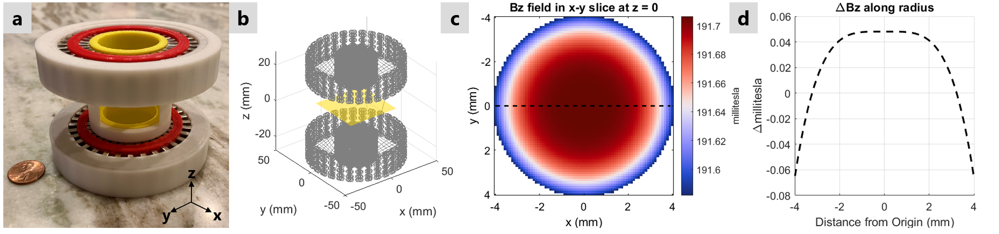

# magnetSimulator
 
 Matlab simulator for magnetic fields generated by 'spokes-and-hub' permanent magnet arrays as presented at ISMRM 2019 [1]
 
 To input magnet geometries and run simulator use:
 ```matlab 
 testMagnet.m
 ```
 
 We have provided [STL](stl) files for a 191 mT magnet constructed using 64 bar magnets (1/2" x 1/8" x 1") from [K&J Magnets](https://www.kjmagnetics.com/proddetail.asp?prod=B82X0)
 
 
We use mechanical tilts from linear actuators to generate gradient fields within the magnet. The actuators were purchased from [Actuonix](https://www.actuonix.com/L12-P-Micro-Linear-Actuator-with-Position-Feedback-p/l12-p.htm)
 

## References

[1] Kuang, I., Arango, N., Stockmann, J., Adalsteinsson, E., White, J. <em>Equivalent-Charge-Based Optimization of Spokes-and-Hub Magnets for Hand-Held and Classroom MR Imaging</em>. Proc. Intl. Soc. Mag. Reson. Med., 2019. 
[2] Kuang, I., Stockmann, J., Adalsteinsson, E., White, J. <em>Mechanical Tilt-Induced Gradient Fields for Low-Field Spokes-and-Hub MR Imagers</em>. Proc. Intl. Soc. Mag. Reson. Med., 2021. 

 Plotting functions use perceptually uniform colormaps from https://colorcet.com/
