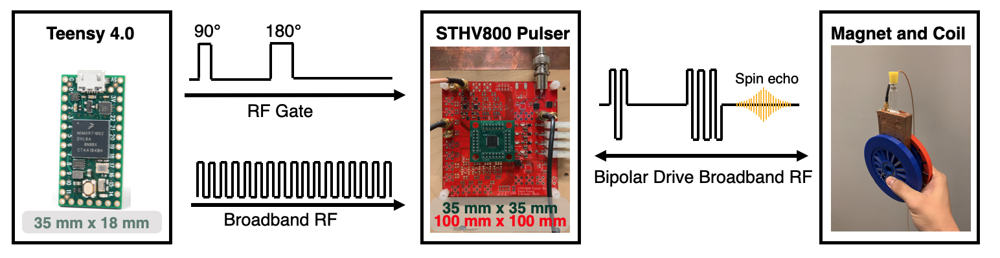

# magnetSimulator
 
 Matlab simulator for magnetic fields generated by 'spokes-and-hub' permanent magnet arrays as presented at ISMRM 2019 [1].
 
 To input magnet geometries and run simulator use:
 ```matlab 
 testMagnet.m
 ```
 
 We have provided [STL](stl) files for a 191 mT magnet constructed using 64 bar magnets (1/2" x 1/8" x 1") from [K&J Magnets](https://www.kjmagnetics.com/proddetail.asp?prod=B82X0).
 
 
 We use mechanical tilts from linear actuators to generate gradient fields within the magnet [2]. The actuators and their control boards were purchased from [Actuonix](https://www.actuonix.com/L12-P-Micro-Linear-Actuator-with-Position-Feedback-p/l12-p.htm). Instructions and [DXF](dxf) files for laser cutting acrylic are provided as well.
 
 
 We use an 8-channel ultrasound h-bridge driver chip from [STMicroelectronics](https://www.st.com/en/switches-and-multiplexers/sthv800.html) to transmit/receive RF on a solenoid coil [3]. A Teensy 4.0 microcontroller sends RF pulses to the driver. We have provided a sample dithered RF pulse (with 100kHz bandwidth) alongside Arduino code that controls the pulses and actuator movements. These files are found in the [signalChain](./signalChain) directory. We also use a USB oscilloscope from Pico Technology ([PicoScope 5243D](https://www.picotech.com/oscilloscope/5000/flexible-resolution-oscilloscope)).
  


## References

[1] Kuang, I., Arango, N., Stockmann, J., Adalsteinsson, E., White, J. <em>Equivalent-Charge-Based Optimization of Spokes-and-Hub Magnets for Hand-Held and Classroom MR Imaging</em>. Proc. Intl. Soc. Mag. Reson. Med., 2019. 

[2] Kuang, I., Stockmann, J., Adalsteinsson, E., White, J. <em>Mechanical Tilt-Induced Gradient Fields for Low-Field Spokes-and-Hub MR Imagers</em>. Proc. Intl. Soc. Mag. Reson. Med., 2021. 

[3] Kuang, I., Arango, N., Stockmann, J., Adalsteinsson, E., White, J. <em>Bloch-Optimized Dithered-Ultrasound-Pulse RF for Low-Field Inhomogeneous Permanent Magnet MR Imagers</em>. Proc. Intl. Soc. Mag. Reson. Med., 2020. 
 
 Plotting functions use perceptually uniform colormaps from https://colorcet.com/
