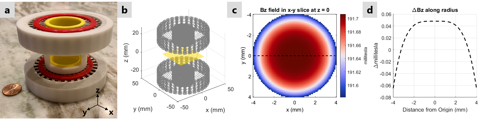

# magnetSimulator
 
 Matlab simulator for magnetic fields generated by 'spokes-and-hub' permanent magnet arrays as presented at ISMRM 2019 [1]
 
 To input magnet geometries and run simulator use:
 ```matlab 
 testMagnet.m
 ```
 
 We have provided [STL](stl) files for a 191 mT magnet constructed using 64 bar magnets from [K&J Magnets](https://www.kjmagnetics.com/proddetail.asp?prod=B82X0)
 
 

## References

[1] Kuang, I., Arango, N., Stockmann, J., Adalsteinsson, E., White, J. <em>Equivalent-Charge-Based Optimization of Spokes-and-Hub Magnets for Hand-Held and Classroom MR Imaging</em>. Proc. Intl. Soc. Mag. Reson. Med., 2019. 

 Plotting functions use perceptually uniform colormaps from https://colorcet.com/
